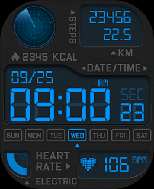

# SMA smart watches watch face editor

The goal of this project is to allow to create and modify watch faces for [SMA-based](https://www.smawatch.com/) smart watches.
Currently, code is developed with help of [Trevi T-Fit 400 C](https://www.trevi.it/catalog/articolo/146-smartwatch/yombjekdjj-t-fit-400-c-smart-fitness-band-curve-nero.html).
The application used by these watches is [`SMART-TIME PRO`](https://play.google.com/store/apps/details?id=com.sma.smartv3.pro&hl=en).

## Prerequisites

Python >= 3.10 is required.
There is `requirements.txt` file which provides required Python packages to run the scripts.

## Format

The watch face data format is described in [`smawf.py`](smawf.py) script.
TODO: describe data format.

## Decompressor

The first tool developed while looking at the watch face data format is [`decompress.py`](decompress.py), which allows to extract all the image resources from watch face file.
Example to extract the images from file `wf.bin` in directory `wf`:
```
python decompress.py -i wf.bin
```

## Edit already existing watch face

The script `edit.py` allows to compress the image resources extracted from a given watch face file and create edited watch face file.
Example to create new watch face file called `wf_edited.bin` from watch face called `wf.bin`, with edited image resources in directory `wf`:

```
python edit.py -i wf.bin -r wf -o wf_edited.bin
```

## Downloading custom watch face to the watch

To download custom watch face to the watch, we can utilize the cache used by the Smart-Time Pro application.
Basically, once we download watch face to the watch from the application, the application caches that watch file file in its data storage directory, which can be found under `Android/data/com.sma.smartv3.pro/cache/dial` directory.
We can replace the cached watch face file in this directory with our custom watch face (using `adb` for example), and then inside the application, we can download the cached watch face to the watch.
The application will preview the original watch face, but our custom one will be downloaded.

ADB steps via Wireless debugging to push custom watch face are given below:
```
adb connect <IP_addr_phone:port>
adb push 'AM08_T-fit 400 C_10011.bin' /storage/self/primary/Android/data/com.sma.smartv3.pro/cache/dial
```
Replace `'AM08_T-fit 400 C_10011.bin'` with other known watch face file.

## Watch faces

The directory `watch_face` currently contains watch faces extracted from the app.

## Gallery

| Preview | File |
| :-----: | :--: |
|  | [10011_blue.bin](watch_faces/10011_blue.bin)

