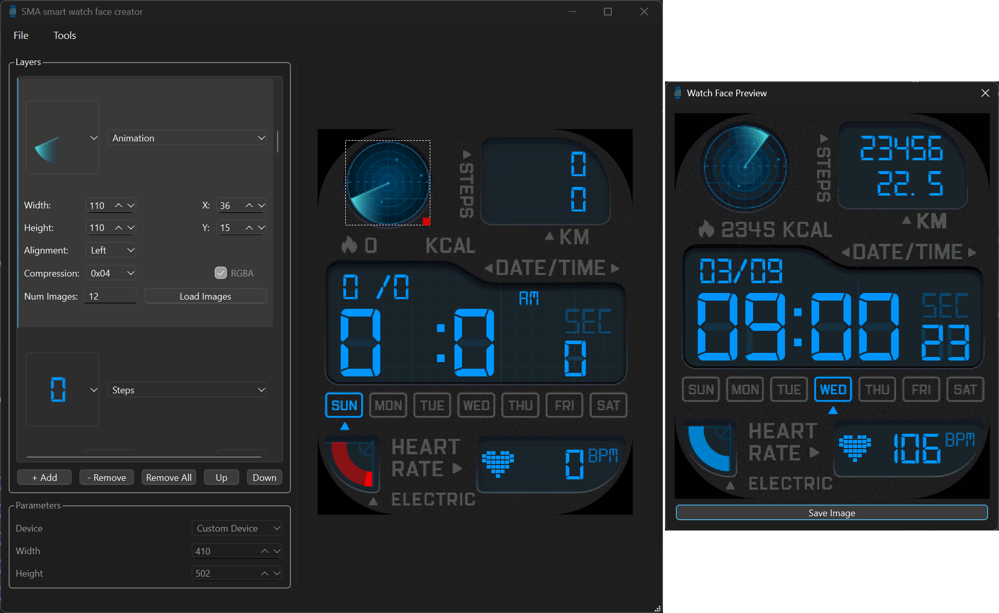

<p align="center">
<picture>

</picture>
<h1 align="center">SMA smart watches watch face editor</h1>
</p>

The goal of this project is to allow to create and modify watch faces for [SMA-based](https://www.smawatch.com/) smart watches.
Code is developed with help of [Trevi T-Fit 400 C](https://www.trevi.it/catalog/articolo/146-smartwatch/yombjekdjj-t-fit-400-c-smart-fitness-band-curve-nero.html).
The application used by these watches is [`SMART-TIME PRO`](https://play.google.com/store/apps/details?id=com.sma.smartv3.pro&hl=en).

**Warning: Use at your own risk!**

## Supported devices

- [Trevi T-Fit 400 C](https://www.trevi.it/catalog/articolo/146-smartwatch/yombjekdjj-t-fit-400-c-smart-fitness-band-curve-nero.html)

## Prerequisites

The project is managed using [`uv`](https://github.com/astral-sh/uv).
Ensure `uv` is installed on the machine and run `uv sync` to fetch all required dependencies.

## SMA watch face creator software

The SMA watch face creator is GUI application providing ability to inspect, edit and create watch faces for supported devices.
The software is structured in two main panes:
- layer view, which shows the different blocks comprising the watch face, along with their parameters, like block type, size, position, etc., and
- scene view, which shows the positioning of different blocks and allows to move, resize and rotate them.

The `File` menu allows to load and save watch face files.
The `Tools` menu allows to create `GIF` preview for the current watch face, but also export all the image resources used in the loaded/created watch face.



## Format

The watch face data format is described in [`smawf.py`](smawf.py) script.
Basically, the watch face file starts with info for how many blocks are there and how many image resources.
After that, there is info for each block, such as block type, size, positioning, etc.
After the blocks meta data, there is table holding the size of each image resource in the watch face file.
Finally, the image resources are placed at the end of the file.
Based on the compression of the resource, pixel data is stored in a different manner.
The data for each pixel is in RGB565 or Alpha + RGB565 format.
Compressed images utilize line-based run-length encoding to shrink down the image size.

## Scripts

### Decompressor

The first tool developed while looking at the watch face data format is [`decompress.py`](decompress.py), which allows to extract all the image resources from watch face file.
Example to extract the images from file `wf.bin` in directory `wf`:
```
python decompress.py -i wf.bin
```

### Edit already existing watch face

The script `edit.py` allows to compress the image resources extracted from a given watch face file and create edited watch face file.
Example to create new watch face file called `wf_edited.bin` from watch face called `wf.bin`, with edited image resources in directory `wf`:

```
python edit.py -i wf.bin -r wf -o wf_edited.bin
```

## Downloading custom watch face to the watch

To download custom watch face to the watch, we can utilize the cache used by the Smart-Time Pro application.
Basically, once we download watch face to the watch from the application, the application caches that watch file file in its data storage directory, which can be found under `Android/data/com.sma.smartv3.pro/cache/dial` directory.
We can replace the cached watch face file in this directory with our custom watch face (using `adb` for example), and then inside the application, we can download the cached watch face to the watch.
The application will preview the original watch face, but our custom one will be downloaded.

ADB steps via Wireless debugging to push custom watch face are given below:
```
adb connect <IP_addr_phone:port>
adb push 'AM08_T-fit 400 C_10011.bin' /storage/self/primary/Android/data/com.sma.smartv3.pro/cache/dial
```
Replace `'AM08_T-fit 400 C_10011.bin'` with other known watch face file.

## Watch faces

The directory `watch_face` contains watch faces obtained from the app, but also modified and custom ones.

## Gallery

| Preview | Device | File |
| :-----: |  :--:  | :--: |
|  | Trevi T-Fit 400 C | [10011_blue.bin](watch_faces/10011_blue.bin)

